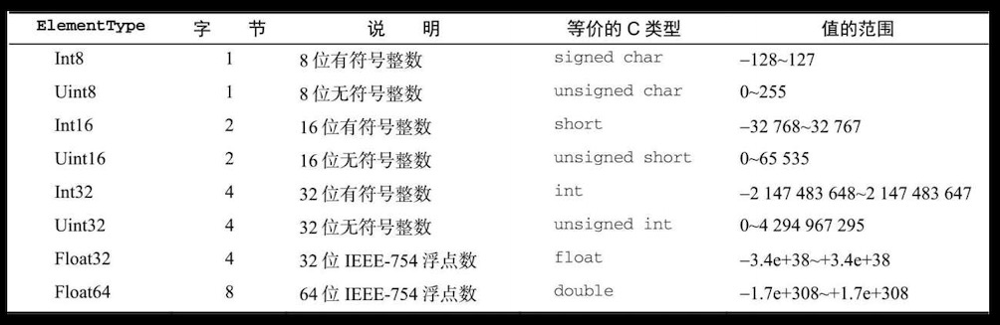

# TypedArray
定型数组TypedArray是ECMAScript新增的结构，目的是`提升向原生库传输数据的效率`。实际上，JavaScript并没有`TypedArray`类型。

## ArrayBuffer
别被名字吓到，它其实就是一个用于`开辟内存的构造函数`，相当于`C语言的malloc`，只是ArrayBuffer分配的内存不需要手动释放，垃圾回收机制会处理。
*用法：*
```js
const buffer = new ArrayBuffer(16) // 在内存中划分16字节
buffer.byteLength // 16
```

## DataView
直译过来就是，`视窗`。想象一种可以横向拖动的窗户🪟，这个窗口可以是一个字节"宽"，也可以是两个字节"宽"。
*用法：*
```js
const buffer = new ArrayBuffer(16) // 在内存中划分16字节
const dataView = new DataView(buffer)
dataView.getInt8(0) // (视窗宽度: 1byte) 读取第一个"视窗"
dataView.getInt16(1) // (视窗宽度: 2bytes) 读取第二个"视窗"
dataView.setInt8(1, 0x8) // (视窗宽度: 1bytes) 写入第二个"视窗"
```
*字节表：*


## 定型数组(Int8Array、Floa8Array...)
相当于选择了特定某一种视窗。
*用法：*
```js
const buffer = new ArrayBuffer(16) // 16个字节
const ints = new Int32Array(buffer) // 32/8=4，4字节视窗
ints.BYTES_PER_ELEMENT // 4
```